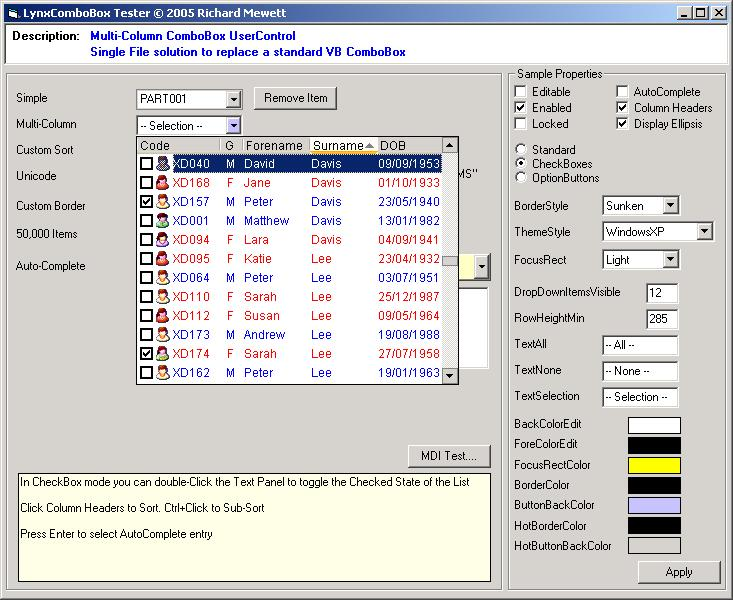



## LynxComboBox v1\.30 \(owner\-drawn Multi\-Column ComboBox with ListView Style\)

### Description

- Updated in response to feedback 11 Nov 06 -

Owner-drawn ComboBox that provides multiple columns in a ListView (in Report View) style display. Features include Item CheckBoxes, Item Images, dynamic Column Sorting/Resizing, Item Formatting (ForeColor, FontBold etc), datatype aware sorts, custom sorts and auto-scrolling (when mouse dragged out of control). Supports native XP Themes &amp; emulation of XP/Office XP Themes. Feedback welcome (votes appreciated!) Credits in source for PSC authors who have helped make this possible.

NOTE: This control has partial Unicode Support (Editable Mode does not support Unicode Data Entry due to VB TextBox)

UPDATE: This Control was formerly called ComboView - renamed for consistency with my other controls.
 
### More Info
 

             |
---                |---
**Submitted On**   |2006-11-11 09:48:26
**By**             |[Richard Mewett](https://github.com/Planet-Source-Code/PSCIndex/blob/master/ByAuthor/richard-mewett.md)
**Level**          |Intermediate
**User Rating**    |4.9 (381 globes from 77 users)
**Compatibility**  |VB 6\.0
**Category**       |[Custom Controls/ Forms/  Menus](https://github.com/Planet-Source-Code/PSCIndex/blob/master/ByCategory/custom-controls-forms-menus__1-4.md)
**World**          |[Visual Basic](https://github.com/Planet-Source-Code/PSCIndex/blob/master/ByWorld/visual-basic.md)
**Archive File**   |[LynxComboB20302411112006\.zip](https://github.com/Planet-Source-Code/richard-mewett-lynxcombobox-v1-30-owner-drawn-multi-column-combobox-with-listview-style__1-61438/archive/master.zip)

